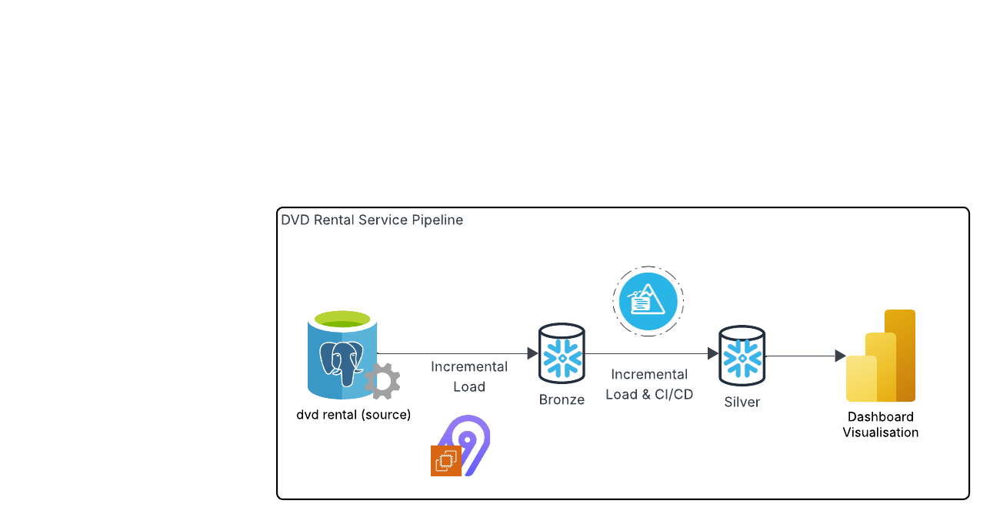

# 📄 DVD Rental Data Warehouse Documentation
**Database:** `AIRBYTE_DATABASE`  
**Schemas:** `ANALYTICS`, `PRODUCTION`  
**Architecture:** Star schema with conformed dimensions, snapshot fact tables, a denormalized BI table, and automated data quality checks using Snowpark Python.

**Contributors:**
- [@carlosofnyc](https://github.com/carlosofnyc) – Data Extraction, Loading (Airbyte, Snowflake)
- [@graham-anderson-RTX](https://github.com/graham-anderson-RTX) – ERD, Visualization (Power BI, Lucidchart)
- [@antoniamayaainoacastro](https://github.com/antoniamayaainoacastro) – Data Modeling, Testing (Snowflake, Python)
  
---

## 🏢 Business Scenario: DVD Rentals

A DVD rental company operates both physical stores and an online mail-based rental service. To remain competitive and data-driven, the company implemented a Snowflake-based data warehouse to answer key business questions, such as:

- Which movies are most popular and profitable?
- Who are the top-performing staff and stores?
- What is the customer repeat rental rate?
- Are there anomalies, such as free rentals or payment discrepancies?
- How does revenue trend by category, date, and location?

The warehouse design features curated tables in the `ANALYTICS` schema and BI-ready views in the `PRODUCTION` schema. Python-powered data quality checks help ensure data integrity and reliability.

---

## Architecture Overview

Data is ingested from the source database into a Snowflake landing area using Airbyte, enabling incremental loads via a datetime cursor. After extraction and loading, Snowpark Python scripts perform data quality validation before records are promoted to the production schema.

Once in production, the data was connected to the business intelligence tool Power BI to accomodate the production of dashboard visualisation. 

---

##  DIM_DATE

### Purpose
Time dimension used for filtering and grouping facts by day, week, month, and year.

### Schema
| Column     | Type   | Description                        |
|------------|--------|------------------------------------|
| DATE_ID    | INT    | Surrogate key in `YYYYMMDD` format |
| FULL_DATE  | DATE   | The full calendar date             |
| DAY        | INT    | Day of the month (1-31)            |
| MONTH      | INT    | Month number (1-12)                |
| YEAR       | INT    | Year in four digits                |
| WEEKDAY    | STRING | Name of the weekday                |
| WEEK       | INT    | ISO week number (1-52)             |

**Load Strategy:** Uses a Snowflake `GENERATOR()` function to load new dates up to `CURRENT_DATE`.

---

##  DIM_FILM

### Purpose
Provides film-level attributes for analysis.

### Schema
| Column             | Type     | Description                          |
|--------------------|----------|--------------------------------------|
| FILM_ID            | INT      | Unique film ID                       |
| TITLE              | STRING   | Film title                           |
| RELEASE_YEAR       | INT      | Year of release                      |
| LENGTH             | INT      | Duration in minutes                  |
| RATING             | STRING   | MPAA rating                          |
| RENTAL_RATE        | NUMBER   | Rental price                         |
| REPLACEMENT_COST   | NUMBER   | Replacement value                    |
| CATEGORY           | STRING   | Film category (e.g., Action, Drama)  |

**Load Strategy:** `MERGE` based on `FILM_ID` with change detection.

---

## DIM_STORE_STAFF

### Purpose
Combines staff and store metadata into a single dimension.

### Schema
| Column         | Type     | Description                      |
|----------------|----------|----------------------------------|
| STAFF_ID       | INT      | Staff unique ID                  |
| STAFF_NAME     | STRING   | Full name                        |
| EMAIL          | STRING   | Email address                    |
| STORE_ID       | INT      | Store identifier                 |
| STORE_ADDRESS  | STRING   | Physical address                 |
| CITY           | STRING   | City name                        |
| COUNTRY        | STRING   | Country name                     |

**Load Strategy:** Uses `MERGE` on `STAFF_ID`.

---

## DIM_LOCATION

### Purpose
Reusable geographic dimension for addresses.

### Schema
| Column        | Type     | Description                      |
|---------------|----------|----------------------------------|
| LOCATION_ID   | INT      | Surrogate key                    |
| ADDRESS_ID    | INT      | Natural key from source          |
| ADDRESS       | STRING   | Address line 1                   |
| ADDRESS2      | STRING   | Address line 2 (optional)        |
| DISTRICT      | STRING   | State or region                  |
| CITY          | STRING   | City name                        |
| COUNTRY       | STRING   | Country                          |
| POSTAL_CODE   | STRING   | Zip code                         |
| PHONE         | STRING   | Contact number                   |

**Load Strategy:** Incremental inserts on new `ADDRESS_ID`.

---

##  FACT_RENTAL_SNAPSHOT

### Purpose
Captures one record per rental with behavioral and financial metrics.

### Schema
| Column                 | Type     | Description                         |
|------------------------|----------|-------------------------------------|
| RENTAL_ID              | INT      | Rental primary key                  |
| CUSTOMER_ID            | INT      | Who made the rental                 |
| FILM_ID                | INT      | What film was rented                |
| DATE_ID                | INT      | Surrogate key for rental date       |
| STAFF_ID               | INT      | Staff processing the rental         |
| STORE_ID               | INT      | Store where rental occurred         |
| NUM_PAYMENTS           | INT      | Count of payments linked to rental  |
| TOTAL_AMOUNT           | NUMBER   | Sum of all payments                 |
| CUSTOMER_RENTAL_RANK   | INT      | Sequential rental number for customer |
| RENTAL_DURATION        | INT      | Days between rental and return      |

---

## FACT_PAYMENT

### Purpose
Captures one row per customer payment.

### Schema
| Column        | Type     | Description                         |
|---------------|----------|-------------------------------------|
| PAYMENT_ID    | INT      | Unique payment ID                   |
| CUSTOMER_ID   | INT      | Payer                               |
| STAFF_ID      | INT      | Staff collecting the payment        |
| FILM_ID       | INT      | Film associated with payment        |
| DATE_ID       | INT      | Surrogate date                      |
| AMOUNT        | NUMBER   | Amount paid                         |
| PAYMENT_DATE  | DATE     | Timestamp of payment                |

**Load Strategy:** `MERGE` on `PAYMENT_ID`, with logic to exclude `AMOUNT <= 0`.

---

## BI_RENTALS_ALL

### Purpose
Fully denormalized table combining all facts and dimensions for easy dashboard consumption.

### Schema
| Column                | Type     | Description                          |
|------------------------|----------|--------------------------------------|
| RENTAL_ID             | INT      | Rental ID                            |
| CUSTOMER_ID           | INT      | Customer ID                          |
| CUSTOMER_NAME         | STRING   | Full name                            |
| CUSTOMER_CITY         | STRING   | City of residence                    |
| CUSTOMER_COUNTRY      | STRING   | Country of residence                 |
| STAFF_ID              | INT      | Staff ID                             |
| STAFF_NAME            | STRING   | Staff full name                      |
| STORE_ID              | INT      | Store ID                             |
| STORE_ADDRESS         | STRING   | Address of store                     |
| STORE_CITY            | STRING   | City of store                        |
| STORE_COUNTRY         | STRING   | Country of store                     |
| FILM_ID               | INT      | Film ID                              |
| FILM_TITLE            | STRING   | Title                                |
| FILM_CATEGORY         | STRING   | Genre                                |
| RELEASE_YEAR          | INT      | Year of release                      |
| RATING                | STRING   | MPAA rating                          |
| FILM_LENGTH           | INT      | Film duration in minutes             |
| DATE_ID               | INT      | Surrogate date                       |
| RENTAL_DATE           | DATE     | Actual rental date                   |
| RENTAL_WEEKDAY        | STRING   | Day of the week                      |
| RENTAL_DURATION       | INT      | Duration in days                     |
| TOTAL_AMOUNT          | NUMBER   | Total paid                           |
| CUSTOMER_RENTAL_RANK  | INT      | Rental number for the customer       |

---

## Data Quality Tests (via Snowpark Python)

We’ve implemented data quality tests using Python inside Snowflake Worksheets. These validate business rules and help detect anomalies.

| Test Name                          | Logic                                                       | Business Meaning                                 |
|-----------------------------------|--------------------------------------------------------------|--------------------------------------------------|
| `payment_id not null`             | `WHERE payment_id IS NULL`                                  | Should always be present — primary key           |
| `amount > 0`                      | `WHERE amount <= 0`                                          | Detects free or refunded rentals                 |
| `film_id must exist in dim_film` | `LEFT JOIN dim_film` and check `NULL`                       | Ensures referential integrity                    |

> ❗ A `FAIL` in the second test (`AMOUNT <= 0`) **does not mean an error** — it may highlight **promotional or free rentals**, which are **expected** but should be **flagged for business awareness**. Any incremental load would not increase the 24 records of the failed test as new updates are controled to have an amount higher than 0 

---

## 📊 Dashboard Generation (Power BI)

Following warehousing, the Snowflake data was connected to the business analytics service Power BI to facilitate dashboard production and downstream analysis.
Dashboards were generated to pertinent business questions such as 'which film title is most profitable?' and 'which store generated the most revenue?'.

Included below are screenshots to evidence the connection to the Snowflake warehouse and generation of visualisations.

Link to published dashboard [HERE](https://app.powerbi.com/groups/me/reports/8b388baa-e6c1-4bfa-9fa2-72573e03af58?ctid=0bb55334-a737-46e1-b018-2a114b78f00f&pbi_source=linkShare&bookmarkGuid=d25af228-3b34-4874-b54d-441533af12e0).

In the event that the live dashboard is unavailable, the PBIX file has been included in the repo.