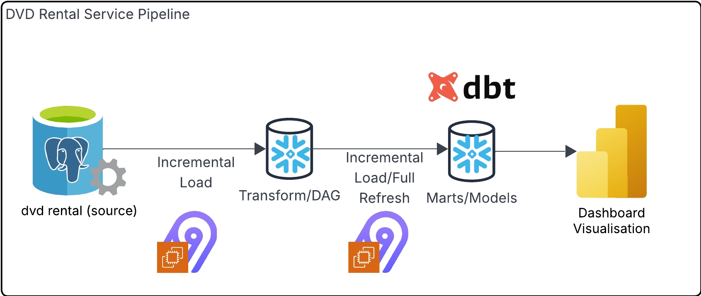

# 📌 DVD Rental Service

## 🎯 Objective
Build a modern, modular and scalable big data pipeline that extracts data incrementally from DVD rental database on Postgres, loads it into Snowflake (raw layer), transforms it using dbt (into clean analytics models), and visualizes it through Power BI. The architecture ensures scalability, modularity, and support for both full refresh and incremental loads.

## 👥 Consumers
- **Business Analysts** — Analyze customer trends, rental patterns, and sales performance.  
- **Product Managers** — Understand customer preferences and optimize film inventory.   
- **Executives/Stakeholders** — Make informed business decisions from dashboards.

## ❓Questions
Will need to see what is visualized in Power BI.

## 🗂️ Source
- **Database**: PostgreSQL  
- **Schema**: DVD Rental  
- **Key Tables**:
  - `rental` – transactional rental info  
  - `customer` – customer demographics and contact  
  - `payment` – revenue per rental  
  - `film`, `category`, `inventory` – film metadata and availability  
  - `store`, `staff` – store and employee info

## 🏗️ Solution Architecture
### Pipeline Diagram

### 🔄 Data Flow Overview
#### 1.  Extract (Airbyte)
- Incremental load from **PostgreSQL** to **Snowflake raw tables** using **airbyte**.
- Efficient ingestion of only **new** or **updated rows**.

#### 2. Transform (dbt)
- SQL-based data modeling with dbt:
  - **Staging Models** – Clean and standardize raw tables.
  - **Intermediate Models** – Apply business logic and join tables.
  - **Mart Models** – Final dimensional models for analysis (fact/dim tables).

#### 3. Load to Marts (Airbyte or dbt)
- Load transformed models into a separate **marts database**.

## Breakdown of tasks